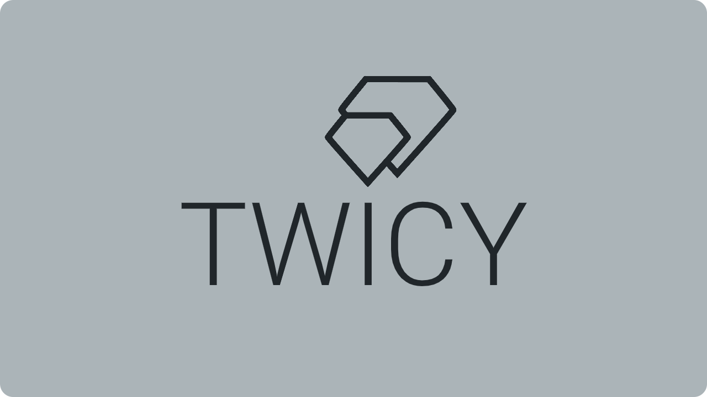
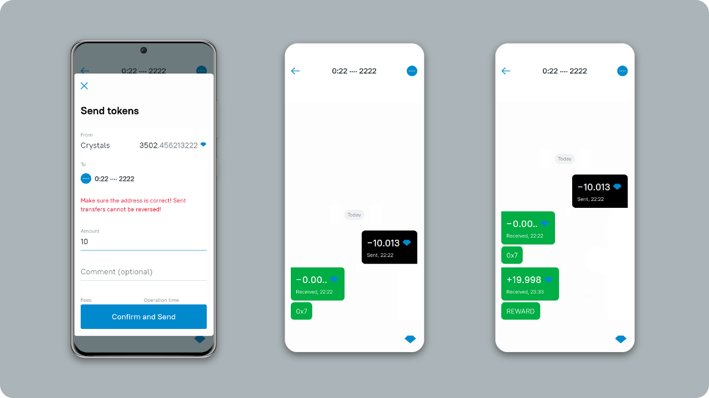
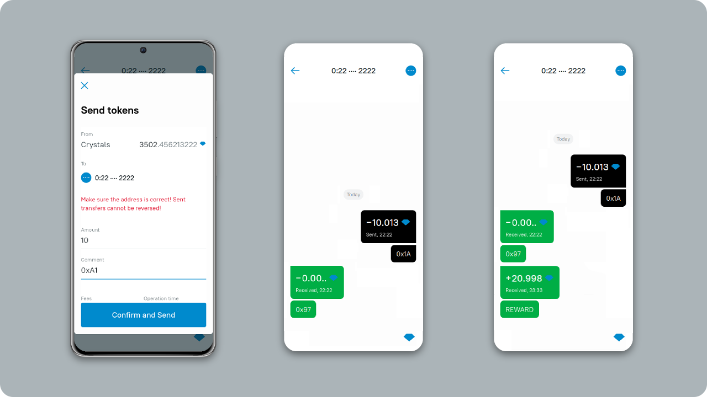
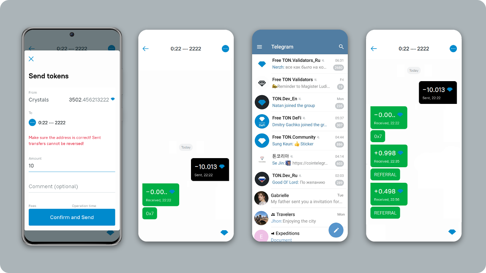
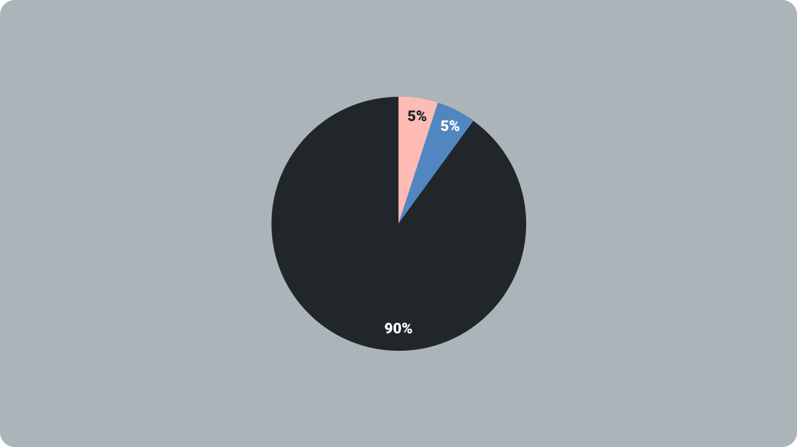
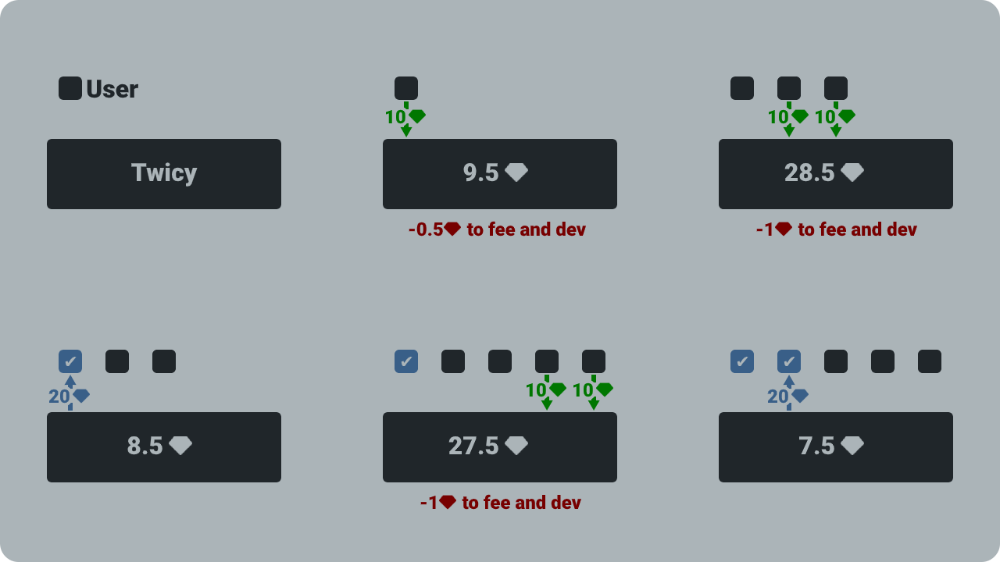
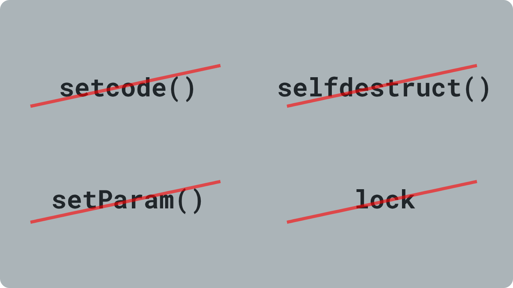
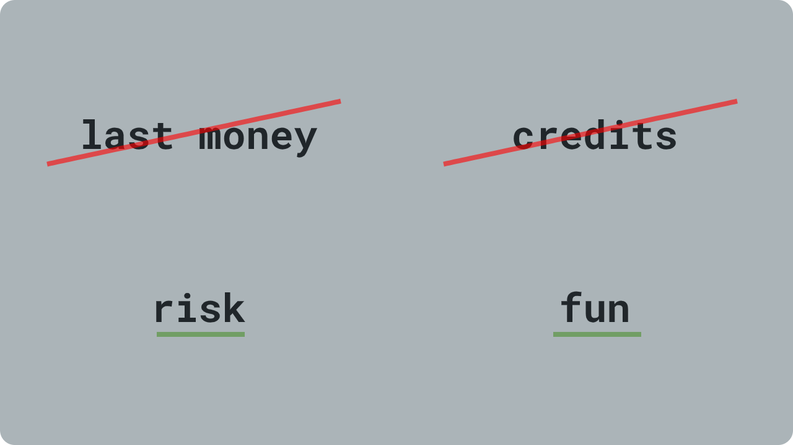
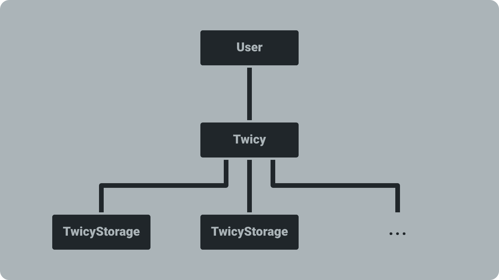

# Twiсy

* First risk-game on Free TON
* 100% on smart-contracts

## Address
```sh
0:22ef8de60d44fd929479d41e7b6f52f25d8de1c9dd02f86f2d175d9ab4dbe922
```
* [ton.live](https://ton.live/accounts/accountDetails?id=0%3A22ef8de60d44fd929479d41e7b6f52f25d8de1c9dd02f86f2d175d9ab4dbe922)
* [net.ton.live](https://net.ton.live/accounts/accountDetails?id=0%3A22ef8de60d44fd929479d41e7b6f52f25d8de1c9dd02f86f2d175d9ab4dbe922)

## How to play

* Send 10💎 to smart-contract
  * If you use [Surf](https://ton.surf/) on mobile use this link [ton://transfer/0:22ef8de60d44fd929479d41e7b6f52f25d8de1c9dd02f86f2d175d9ab4dbe922?amount=10000000000](ton://transfer/0:22ef8de60d44fd929479d41e7b6f52f25d8de1c9dd02f86f2d175d9ab4dbe922?amount=10000000000). If link not clickable then sorry. Github parser has not yet learned how to make links for the Free TON
  * More than 10💎 and less than 10💎 are not acceptable
* Get an answer and wait your turn
* Get 20💎

## How to get x2.2

* Send 10💎 to smart-contract
  * Get a referral ID from another player
  * Write referral ID in the comment field
* Get an answer and wait your turn
* Get 21💎

Own referral ID do not give you bonus multiplier

## Earn more — become referrer

 * Send 10💎 to smart-contract
 * Receive referral ID in answer
 * Invite other users to the game. Ask them to make a deposit and input the referral ID in the comment to the transfer
 * You will get 0.5💎 from every 10💎 deposits of your referrals
 
You can use this links to invite users pay via mobile surf. Replace **0x0** at the end of the link to your referral ID
ton://transfer/0:22ef8de60d44fd929479d41e7b6f52f25d8de1c9dd02f86f2d175d9ab4dbe922?amount=10000000000&text=**0x0**

## Economics

* **90%** - 9💎 from every 10💎 - payouts to participants
* **5%** - 0.5💎 from every 10💎 - developers reward and fee for smart-contracts
* **5%** - 0.5💎 from every 10💎 - referrer reward if user set referral ID. If referral ID doesn't set, then part pay outs to participants
 
## How it works

Participants receive payments in turn
 
 
## Security

* **No setcode().** Nobody can change the contract
* **No selfdestruct().** Nobody can destroy the contract
* **No setters.** Nobody can change parameters of contract
* **Doesn't store many crystals.** Nobody can steal all crystals

## Responsibility game

* Don't play on last money
* Don't take credits to play
* Play at own risk
* It's just fun

## Tech
### Structure

* **User** - user wallet
* **Twicy** - main contract. Collects crystals and pays out rewards
* **TwicyStorage** - Deployed by main contract. It stores information about deposits

### Call stacks
#### Deposit
```
Twicy.deposit()
  _depositWithoutReferralBonus()
    _deposit()
      _depositConfirmation()
        → 0.001💎 to USER
      _save()
        → 0.2💎 to TwicyStorage.save()
      _dispatchDepositsForPayout()
        → 0.2💎 to TwicyStorage.dispatchDepositsForPayout()
          → +0.1💎 to Twicy.onReceiveDepositsForPayout()
            → reward 💎 to USER
```

#### Deposit with referral id
```
Twicy.depositWithReferralId()
  _dispatchReferrerAddress()
    → 0.2💎 to TwicyStorage.dispatchReferrerAddress()
      → +0.1💎 to Twicy.onReceiveReferrerAddress()
        → reward 💎 to REFERRER
        _depositWithReferralBonus() or _depositWithoutReferralBonus()
          _deposit()
             
          ... same as simple deposit
```

### Deploy
#### 1. Compile TwicyStorage
```sh
solc TwicyStorage.sol
tvm_linker compile TwicyStorage.code -o TwicyStorage.tvc
tvm_linker decode --tvc TwicyStorage.tvc > code.txt
```

#### 2. Copy code from code.txt
```text
te6ccgECMQEACEYAAib/APSk ... 84AHwAfhHbpMw8jze
```

#### 3. Compile Twicy
```sh
solc Twicy.sol
tvm_linker compile Twicy.code -o Twicy.tvc
tonos-cli genaddr Twicy.tvc Twicy.abi.json --genkey Twicy.keys.json
```

#### 4. Send minimum 3💎 on generated address and deploy
```sh
tonos-cli deploy Twicy.tvc '{"storageCode": "te6ccgECMQEACEYAAib/APSk ... 84AHwAfhHbpMw8jze","storageLength": 20000}' --abi Twicy.abi.json --sign Twicy.keys.json
```

### Deployment tools
Solc from [TON Solidity Compiler](https://github.com/tonlabs/TON-Solidity-Compiler)
```
solc, the solidity compiler commandline interface
Version: 0.6.3-develop.2020.12.13+commit.54c8a5a1.mod.Linux.g++
```

[TVM linker](https://github.com/tonlabs/TVM-linker)
```
TVM linker 0.1.0
COMMIT_ID: 2e15070e458637add2ecb279a03bd88d8df37bde
BUILD_DATE: 2020-12-13 03:25:46 +0300
COMMIT_DATE: 2020-11-20 10:57:07 +0300
GIT_BRANCH: master
```

[tonos-cli](https://github.com/tonlabs/tonos-cli)
```
tonos_cli 0.1.28
COMMIT_ID: a389881108384118ba1a565a0450762fdabeb705
BUILD_DATE: 2020-12-13 03:41:14 +0300
COMMIT_DATE: 2020-11-30 17:42:19 +0300
GIT_BRANCH: master
```

### Migration
[Migration from v1.0.0 to 1.1.0](MIGRATION.md)

## Telegram
[@freeton_twicy](https://t.me/freeton_twicy)